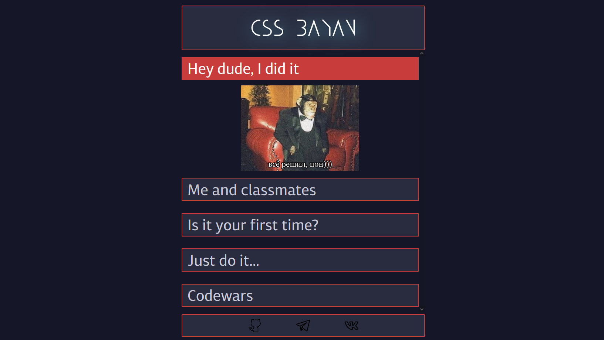

## CSS-BAYAN 

This is "css-bayan", the mobile-adaptive list of memes. The main difficulty is state storing of cards. Javascript is not allowed!

Functional requirements(breafly):

1. Design is at your discretion, but the layout of an accordion should include a meme image, text, and an icon. The placement of these elements should match the provided above example image

2. Implement responsive design with three breakpoints. Accordion is displayed correctly at mobile 320x568, tablet 820x1180, desktop 1920×1080;

3. There should be icon for state of the expanded\collapsed item (you can choose your own icons e.g. from FontAwesome);

4. Implement visual effects when the cursor is hovering over the memes, when the mouse is down on a meme (moment of mouse down - for active effect);

5. Smooth transitions are applied for changing of memes and for changing of icon;

6. Make the entire row (text, icon, and meme image) clickable;

7. Mobile first approach is used - cursor over the memes (hover) effect exists only for desktop devices MDN Note;

8. Center the accordion component on the screen, with equal indents on the left and right;

9. Change the cursor when it is hovering over the accordion;

10. Initially, the first meme should be expanded (chosen/selected);

11. Font size should be changed at each device (mobile, tablet, desktop)

 

This project gave me experience at the following points: 

- storage of a state without JS (only checkbox state)
- layout design working
- adaptive design media queries
- handling with svg
- deploying on the GitHub

 *Screenshot of the landing:* 

